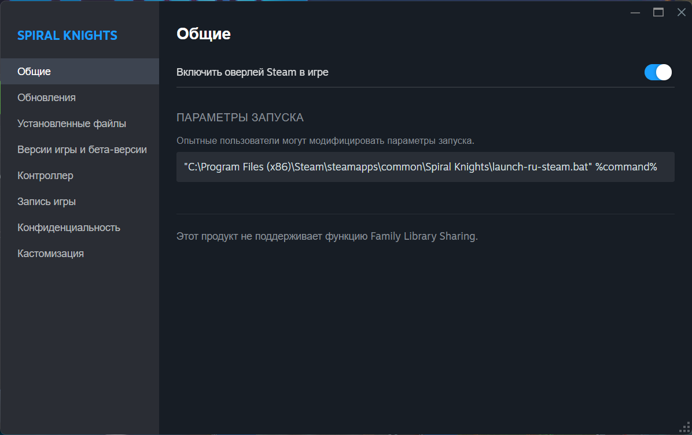
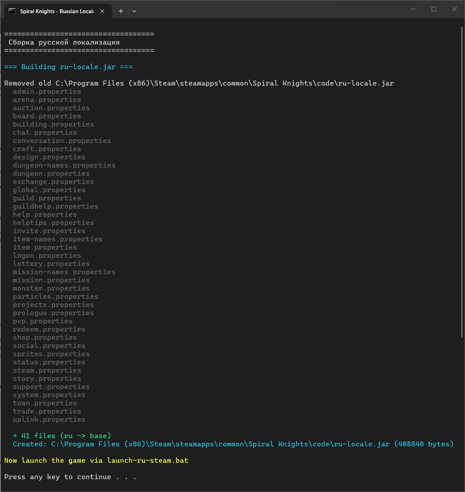

# 📦 Установка русской локализации Spiral Knights

## Способ 1: Из готового архива (рекомендуется)

### Шаг 1 — Скачайте архив

Скачайте последний `SpiralKnights-RU-*.zip` из раздела **[Releases](https://github.com/genius8loci/Spiral-Knights-Russia/releases)**.

### Шаг 2 — Найдите папку с игрой

Стандартный путь Steam-версии:
```
C:\Program Files (x86)\Steam\steamapps\common\Spiral Knights\
```

Если вы устанавливали Steam в другое место, откройте Steam → ПКМ на Spiral Knights → Управление → Просмотреть локальные файлы.

Вы в нужной папке, если видите файл `crucible.jar`.

### Шаг 3 — Распакуйте архив

Распакуйте **все файлы** из архива прямо в папку с игрой.

После распаковки в папке с игрой должны появиться:
```
Spiral Knights/
├── code/
│   └── ru-locale.jar        ← файл перевода
├── launch-ru-steam.bat       ← скрипт запуска
├── launch-ru-debug.bat       ← скрипт отладки
└── README-RU.txt             ← памятка
```

### Шаг 4 — Запустите игру

**Вариант A — Через BAT-файл (самый простой):**

Дважды щёлкните `launch-ru-steam.bat` в папке с игрой.

**Вариант B — Через Steam (с трекингом часов):**

Чтобы Steam считал время в игре и показывал статус «В игре»:



1. Откройте Steam
2. ПКМ на **Spiral Knights** → **Свойства**
3. Раздел **Общие** → поле **Параметры запуска**
4. Вставьте:
   ```
   "C:\Program Files (x86)\Steam\steamapps\common\Spiral Knights\launch-ru-steam.bat" %command%
   ```
   > ⚠️ Если игра установлена в другой папке — подставьте свой путь.
5. Закройте окно свойств
6. Нажмите **Играть** как обычно

Теперь при каждом нажатии «Играть» Steam запустит русскую версию.

---

## Способ 2: Сборка из исходников

Если вы хотите собрать перевод самостоятельно (для разработки или своих правок):

### Шаг 1 — Разместите файлы

Клонируйте или скопируйте папку `ru-locale` в директорию игры:

```
Spiral Knights/
├── ru-locale/        ← папка проекта
│   ├── ru/           ← файлы перевода
│   ├── build-ru-locale.bat
│   └── ...
├── code/
├── crucible.jar
└── ...
```

### Шаг 2 — Соберите JAR

Запустите `ru-locale\build-ru-locale.bat`.

Скрипт создаст `code\ru-locale.jar` из файлов в папке `ru/`.



### Шаг 3 — Запустите

Скопируйте `launch-ru-steam.bat` из `ru-locale/` в корень папки игры, затем запустите его — или настройте Steam (см. Вариант B выше).

---

## ✅ Проверка

Если всё сделано правильно:
- При запуске через `launch-ru-steam.bat` в заголовке окна будет написано **Spiral Knights (Russian)**
- Меню, кнопки, описания предметов и задания будут на русском языке
- В режиме отладки (`launch-ru-debug.bat`) в консоли видны параметры запуска

---

## 🔄 Откат на английский

Чтобы вернуть английскую версию:

**Если настроено через Steam:**
1. Steam → ПКМ на Spiral Knights → Свойства
2. Очистите поле «Параметры запуска»
3. Запустите игру обычным способом

**Удаление файлов перевода (необязательно):**
```
Удалите:
  code\ru-locale.jar
  launch-ru-steam.bat
  launch-ru-debug.bat
```

Оригинальные файлы игры не были изменены — всё остальное работает как прежде.

---

## 🔧 Решение проблем

### Игра не запускается

- Убедитесь, что `launch-ru-steam.bat` находится в той же папке, что и `crucible.jar`
- Проверьте, что существует `code\ru-locale.jar`
- Запустите `launch-ru-debug.bat` — он покажет параметры запуска и ошибки в консоли

### Текст отображается на английском

- Убедитесь, что вы запускаете игру через `launch-ru-steam.bat`, а не обычным способом
- Проверьте, что `code\ru-locale.jar` существует и не пустой
- Пересоберите JAR через `build-ru-locale.bat`

### Steam не считает время в игре

- Проверьте, что параметры запуска в Steam настроены правильно (способ B)
- Путь в кавычках должен вести к `launch-ru-steam.bat` — именно он запускает игру через Steam Runtime

### Ошибка «code\ru-locale.jar not found»

Запустите `ru-locale\build-ru-locale.bat` для сборки JAR-файла.
