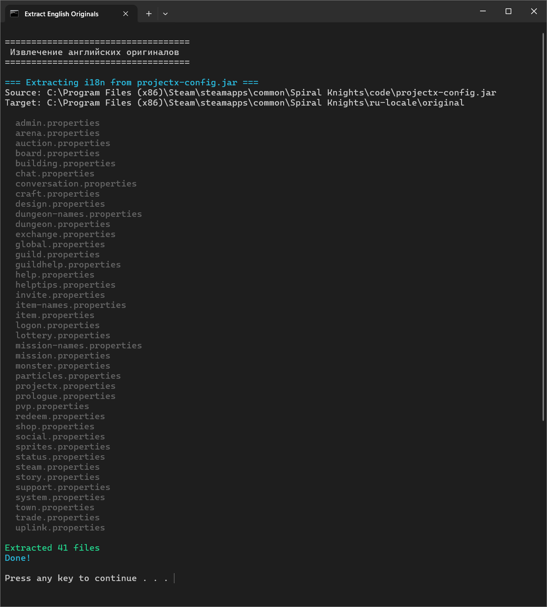
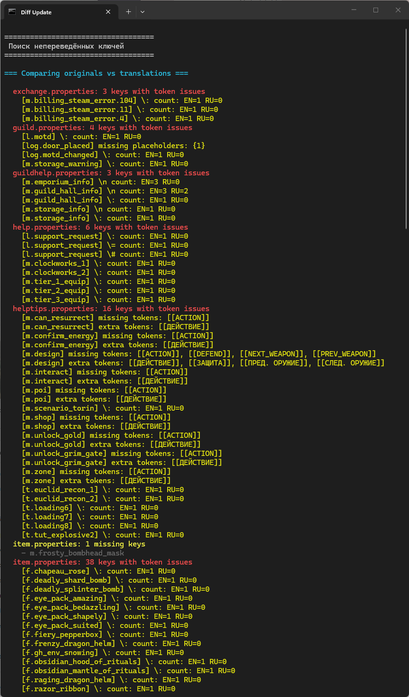
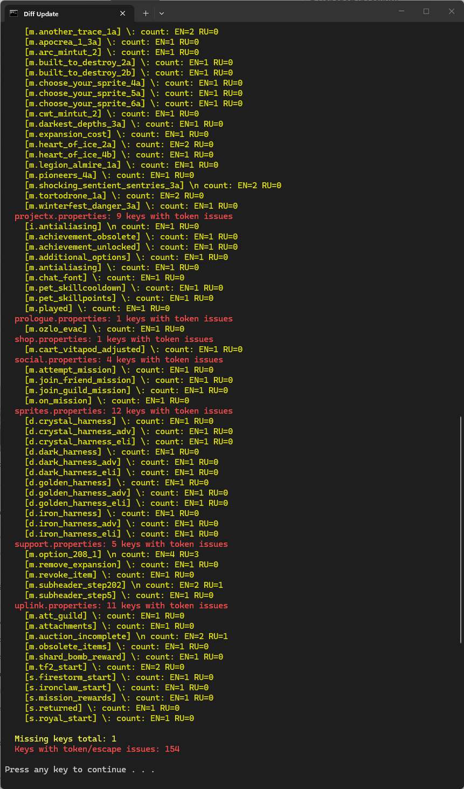
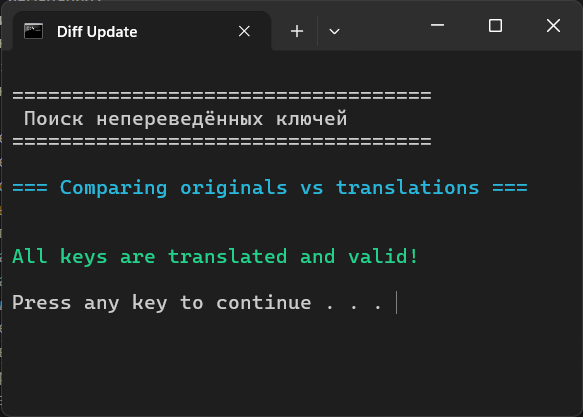

# 🌍 Гайд для переводчиков

Пошаговая инструкция для тех, кто хочет улучшить русский перевод или создать локализацию на свой язык.

---

## 📋 Содержание

- [Обзор: как устроен перевод](#-обзор-как-устроен-перевод)
- [Подготовка рабочего окружения](#-подготовка-рабочего-окружения)
- [Извлечение английских оригиналов](#-шаг-1--извлечение-английских-оригиналов)
- [Редактирование перевода](#-шаг-2--редактирование-перевода)
- [Формат .properties файлов](#-формат-properties-файлов)
- [Спецсимволы и плейсхолдеры](#-спецсимволы-и-плейсхолдеры)
- [Сборка и тестирование](#-шаг-3--сборка-и-тестирование)
- [Проверка качества](#-шаг-4--проверка-качества)
- [Создание перевода на другой язык](#-создание-перевода-на-другой-язык)
- [Советы по переводу](#-советы-по-переводу)

---

## 🔍 Обзор: как устроен перевод

Spiral Knights хранит все текстовые строки в `.properties` файлах внутри `code/projectx-config.jar` в папке `rsrc/i18n/`. Это стандартный Java-формат локализации.

Принцип работы перевода:

1. Мы **извлекаем** англоязычные `.properties` файлы из JAR-архива игры
2. **Переводим** значения ключей на нужный язык
3. **Упаковываем** переведённые файлы в отдельный `ru-locale.jar`
4. При запуске `ru-locale.jar` ставится **первым в classpath** — Java загружает его раньше оригинала

Ни один файл игры при этом не изменяется.

---

## 🧰 Подготовка рабочего окружения

### Что понадобится

- **Spiral Knights** (установленная через Steam)
- **Текстовый редактор** с поддержкой UTF-8:
  - [VS Code](https://code.visualstudio.com/) (рекомендуется)
  - Notepad++ или любой другой
- **Windows PowerShell** (встроен в Windows)
- **Git** (для совместной работы, необязательно)

### Расположение проекта

Папка `ru-locale` должна находиться внутри папки игры:

```
Spiral Knights/
├── code/
│   └── projectx-config.jar    ← отсюда берём оригиналы
├── ru-locale/                  ← проект перевода
│   ├── original/               ← английские оригиналы
│   ├── ru/                     ← файлы перевода
│   └── *.ps1 / *.bat           ← скрипты
└── crucible.jar
```

---

## 📥 Шаг 1 — Извлечение английских оригиналов

Запустите `extract-originals.bat` (или `extract-originals.ps1`).



Скрипт:
- Открывает `code/projectx-config.jar`
- Находит все файлы `rsrc/i18n/*.properties` (без суффикса локали)
- Копирует их в папку `original/`

```
ru-locale\original\
├── global.properties
├── item-names.properties
├── mission.properties
└── ... (41 файл)
```

> 💡 Запускайте этот скрипт после каждого обновления игры, чтобы иметь актуальные оригиналы.

---

## ✏️ Шаг 2 — Редактирование перевода

ПРОДУБЛИРУЙТЕ файлы для перевода в папку `ru/`. Каждый файл соответствует файлу из `original/`.

### Рабочий процесс

1. Откройте файл из `original/` — это английский оригинал (справка)
2. Откройте соответствующий файл в `ru/` — это перевод
3. Переведите значения ключей, **не меняя сами ключи**

### Пример

Оригинал (`original/global.properties`):
```properties
m.cancel=Cancel
m.ok=OK
m.yes=Yes
m.no=No
```

Перевод (`ru/global.properties`):
```properties
m.cancel=Отменить
m.ok=ОК
m.yes=Да
m.no=Нет
```

> ⚠️ **Важно:** ключ (левая часть до `=`) должен точно совпадать с оригиналом. Переводите только значение (правая часть после `=`).

---

## 📐 Формат .properties файлов

Файлы `.properties` — текстовый формат Java для хранения пар «ключ=значение».

### Основные правила

```properties
# Это комментарий (игнорируется)
ключ=значение
ключ.с.точками=значение с пробелами
пустой.ключ=
```

- Одна пара `ключ=значение` на строку
- Строки, начинающиеся с `#` или `!` — комментарии
- Пробелы вокруг `=` игнорируются
- Значение продолжается до конца строки
- Кодировка: **UTF-8**

---

## ⚡ Спецсимволы и плейсхолдеры

При переводе **обязательно сохраняйте** все специальные конструкции:

### Плейсхолдеры `{0}`, `{1}`, `{2}`...

Подставляются игрой во время выполнения. Порядок может меняться, но набор должен совпадать.

```properties
# EN: You received {0} crowns from {1}.
# RU: Вы получили {0} крон от {1}.
m.received=Вы получили {0} крон от {1}.
```

### Токены `[[НАЗВАНИЕ]]`

Специальные маркеры, которые игра заменяет на элементы интерфейса или другие строки.

```properties
# EN: Press [[ACTION]] to continue
# RU: Нажмите [[ACTION]] чтобы продолжить
m.press_action=Нажмите [[ACTION]] чтобы продолжить
```

> ⚠️ Токены `[[...]]` нельзя переводить — это ссылки на внутренние идентификаторы игры. Переносите их как есть.

### Escape-последовательности

| Последовательность | Значение |
|-------------------|----------|
| `\n` | Перенос строки |
| `\t` | Табуляция |
| `\:` | Двоеточие (экранированное) |
| `\=` | Знак равенства (экранированное) |
| `\#` | Решётка (экранированная) |

Количество escape-последовательностей в переводе должно совпадать с оригиналом (проверяется скриптом `diff-update`).

---

## 🔨 Шаг 3 — Сборка и тестирование

### Сборка

Запустите `build-ru-locale.bat`:


```
> ru-locale\build-ru-locale.bat

 Сборка русской локализации

  global.properties
  item-names.properties
  ...

  + 41 files (ru -> base)
  Created: code\ru-locale.jar (XXXXX bytes)
```

Скрипт создаёт `code\ru-locale.jar`, упаковывая все `.properties` из `ru/` в путь `rsrc/i18n/` внутри JAR.

### Тестирование

1. Запустите `launch-ru-debug.bat` (режим с консолью)
2. Проверьте, что текст в игре отображается на русском
3. Пройдитесь по интерфейсу: меню, инвентарь, задания, магазин
4. Обратите внимание на:
   - Обрезанный текст (слишком длинный перевод)
   - Неправильные плейсхолдеры (текст вроде `{0}` не заменяется)
   - Нечитаемые символы (проблемы с кодировкой)

> 💡 При отладке не нужно перезапускать игру для каждого изменения в `.properties` — достаточно пересобрать JAR и перезапустить игру.

---

## ✅ Шаг 4 — Проверка качества

### Автоматическая проверка

Запустите `diff-update.bat` для автоматического анализа:





```
> ru-locale\diff-update.bat

 Поиск непереведённых ключей

  item.properties: 3 missing keys
    - m.new_key_1
    - m.new_key_2
    - m.new_key_3
  shop.properties: 1 keys with token issues
    [m.buy_confirm] missing placeholders: {1}
```

Скрипт проверяет:

| Проверка | Описание |
|----------|----------|
| **Отсутствующие файлы** | Файлы из `original/`, для которых нет файла в `ru/` |
| **Отсутствующие ключи** | Ключи, которые есть в оригинале, но отсутствуют в переводе |
| **Плейсхолдеры `{N}`** | Все `{0}`, `{1}` и т.д. из оригинала должны быть в переводе |
| **Токены `[[...]]`** | Все `[[TOKEN]]` из оригинала должны сохраняться |
| **Escape-последовательности** | Количество `\n`, `\t`, `\:`, `\=`, `\#` должно совпадать |

### Ручная проверка

- Откройте игру и проверьте ключевые экраны
- Сравните с оригиналом — смысл переведён корректно?
- Текст помещается в элементы UI?

---

## 🌐 Создание перевода на другой язык

Если вы хотите перевести игру на другой язык (украинский, казахский и т.д.):

### 1. Создайте папку для своего языка

```
ru-locale/           →     ua-locale/
├── ru/              →     ├── ua/
├── original/        →     ├── original/
└── *.ps1            →     └── *.ps1 (скопировать и адаптировать)
```

### 2. Скопируйте и адаптируйте скрипты

В скриптах замените пути:
- `$ruDir` → `$uaDir` (или ваша папка)
- Имя JAR: `ru-locale.jar` → `ua-locale.jar`
- Названия в `launch-*.bat` по вкусу

### 3. Начните перевод

Рекомендуемый порядок файлов (от самых заметных к менее важным):

1. **`global.properties`** — кнопки, базовые слова (Да, Нет, Отменить)
2. **`logon.properties`** — экран входа
3. **`item-names.properties`** — названия предметов
4. **`item.properties`** — описания предметов
5. **`mission.properties`** и **`mission-names.properties`** — задания
6. **`dungeon.properties`** и **`dungeon-names.properties`** — подземелья
7. **`conversation.properties`** — диалоги NPC
8. **`shop.properties`**, **`trade.properties`** — торговля
9. Всё остальное

### 4. Соберите и тестируйте

Используйте те же скрипты сборки, адаптировав пути.

---

## 💡 Советы по переводу

### Общие рекомендации

- **Играйте в игру** перед переводом — контекст важен
- **Сохраняйте единообразие** — одно понятие = один термин по всем файлам
- **Не переводите имена собственные** — Spiral Knights, Haven, Cradle остаются как есть (или транслитерируйте консистентно)
- **Учитывайте длину** — русский текст обычно длиннее английского, UI может обрезать

### Глоссарий типичных терминов

| Английский | Русский | Примечание |
|-----------|---------|-----------|
| Crown(s) | Крона / Кроны | Валюта |
| Energy | Энергия | Ресурс |
| Heat | Жар | Опыт предмета |
| Forge | Ковать | Улучшение предметов |
| Recipe | Рецепт | Чертёж крафта |
| Lockdown | Lockdown | Режим PvP (можно оставить) |
| Blast Network | Blast Network | Режим PvP (можно оставить) |
| Clockworks | Часовой механизм | Подземелье |
| Knight | Рыцарь | Класс персонажа |
| Guild | Гильдия | Клан |
| Arcade | Аркада | Вход в подземелья |

### Работа в VS Code

Рекомендуемые расширения:
- **Properties** — подсветка синтаксиса `.properties`
- **Diff Editor** — удобное сравнение файлов бок о бок

Откройте `original/file.properties` и `ru/file.properties` рядом (Split Editor) для удобного сравнения.

---

## 📦 Упаковка релиза

Когда перевод готов, запустите `pack-release.bat`.

Скрипт:
1. Проверяет наличие `code\ru-locale.jar`
2. Упаковывает в ZIP:
   - `code/ru-locale.jar` — перевод
   - `launch-ru-steam.bat` — запуск через Steam
   - `launch-ru-debug.bat` — запуск с отладкой
   - `README-RU.txt` — инструкция для пользователя
3. Создаёт `SpiralKnights-RU-ГГГГ-ММ-ДД.zip`

---

## 🔄 Обновление после патча игры

Когда Spiral Knights обновляется:

1. Запустите `extract-originals.bat` — получите актуальные английские оригиналы
2. Запустите `diff-update.bat` — найдите новые/изменённые ключи
3. Переведите недостающие ключи
4. Пересоберите: `build-ru-locale.bat`
5. Протестируйте

---

## 📝 Чеклист перед публикацией

- [ ] Все файлы из `original/` имеют соответствие в `ru/`
- [ ] `diff-update.bat` не показывает отсутствующих ключей
- [ ] `diff-update.bat` не показывает проблем с токенами/плейсхолдерами
- [ ] Игра запускается через `launch-ru-debug.bat` без ошибок
- [ ] Основные экраны проверены вручную (меню, инвентарь, задания, магазин)
- [ ] Файлы в кодировке UTF-8
